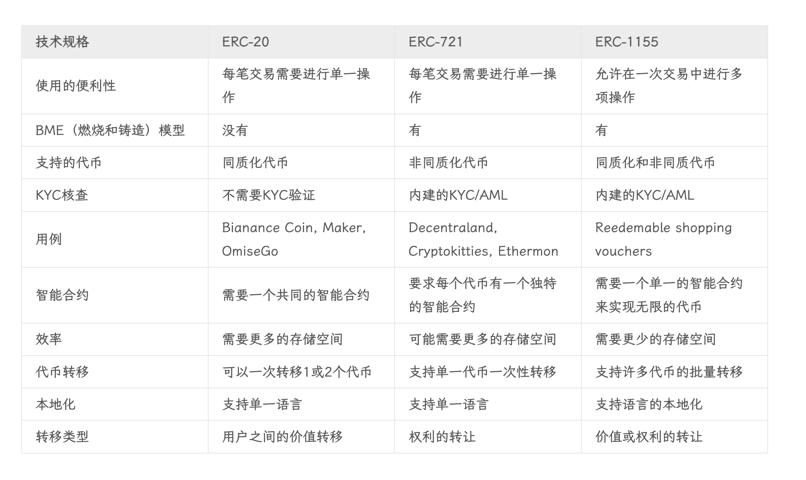
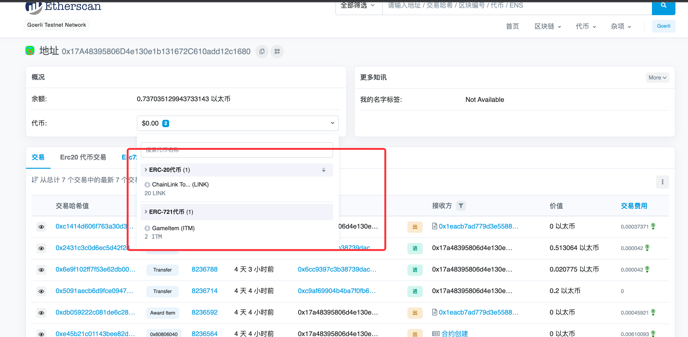
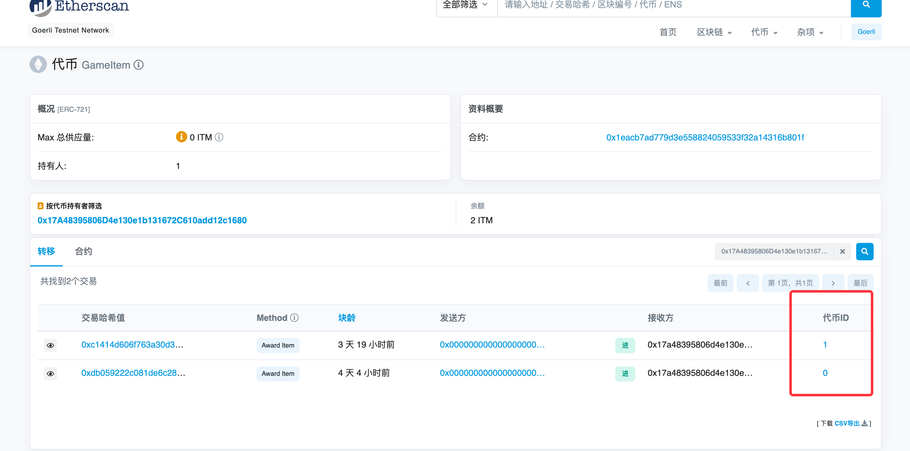
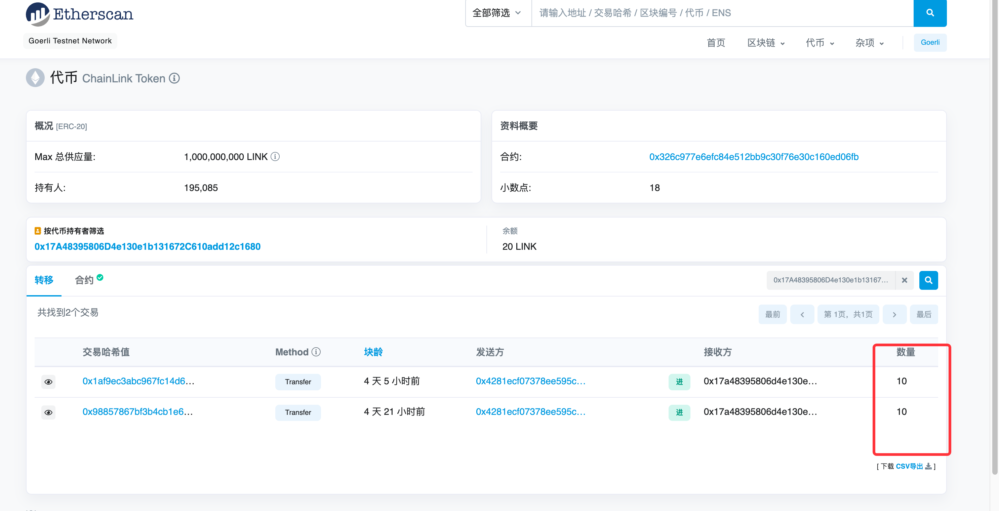

## 概念

```
# 基础知识（https://help.tokenpocket.pro/cn/the-basics/what-is-the-miner-fee）
链：第二代区块链 以太坊
币：私有链和联盟链可以不发行币，因为服务器都是自己的，无意义，只需具备共识机制即可
代币：同质化代币erc20、非同质化代币erc721
gas: 矿工费 = Gas Limit * Gas Price 网络费，顾名思义就是支付给矿工的手续费，当您在区块链上进行转账时，矿工（或节点）需要把您的转账交易打包并放上区块链，才能使交易完成，在这过程中会消耗区块链的运算资源，因此产生矿工费用。
txn(Transaction Hash): 交易哈希，可以理解为交易编号
区块浏览器：查询区块链上的信息
dex: 去中心化交易所  uniswap 自动做市商
中心化交易所：币安等
合约地址：有代码  内部账户  只有代码没有私钥
账户地址：无代码  外部账户  无代码有私钥
# 如何在不同链部署地址完全相同的合约
https://zhuanlan.zhihu.com/p/455735178
```

## 交易网站

```
币安交易所：https://www.binance.com
ntf交易：https://opensea.io/collection
预言机：https://docs.chain.link/vrf/v2/introduction
合约标准库：https://docs.openzeppelin.com/contracts/4.x/tokens
nftsacn: https://www.nftscan.com/
gas: https://ethgasstation.info/
综合搜索网站：https://blockscan.com/
```

## 原生代币

```
ETH: 用于支付gas费用（交易需要花费ETH）
```

## 发行代币

```
Ethereum Request for Comments: ERC
https://ethereum.org/zh/developers/docs/standards/tokens/erc-721/
https://hicoldcat.com/posts/blockchain/erc/

ERC-20: 同质化代币 (eg. imtoken)
ERC-721： 非同质化代币（eg. nft）
ERC-1155: ERC-1155可以执行ERC-20和ERC-720的功能，甚至可以同时执行两者,ERC-1155适用于创建NFT、可兑换购物券、ICO等
ERC-4626: 借贷市场、聚合器和本质上计息的代币可以帮助用户通过执行不同的策略来找到他们的加密代币的最佳收益
```



## 测试币

```
# 水龙头
# 以下地址可以领取 goerli 币
https://goerli-faucet.pk910.de/
https://goerlifaucet.com/

# sepolia
https://sepolia-faucet.pk910.de/
```

[](doc/img.png)

## erc理解

```
1. 外部地址：每个账户拥有的代币，可以在 scan页面看到
2. 合约地址：记录交易记录、交易事件、代币情况
3. 可以看到erc20展示的是数量(发行量固定，不会贬值，要么泡沫要么升值，即同质性)，erc721展示的是代币ID(每个代币的价值都不同，即非同质性)

# 代币
https://goerli.etherscan.io/token/0x326c977e6efc84e512bb9c30f76e30c160ed06fb?a=0x17A48395806D4e130e1b131672C610add12c1680
https://goerli.etherscan.io/token/0x1eacb7ad779d3e558824059533f32a14316b801f?a=0x17A48395806D4e130e1b131672C610add12c1680
# 合约 
https://goerli.etherscan.io/address/0x1eACb7AD779d3e558824059533F32A14316B801F
https://goerli.etherscan.io/address/0x326c977e6efc84e512bb9c30f76e30c160ed06fb  chainlink
# 账户  展示交易记录 下属代币 交易gas 交易tx
https://goerli.etherscan.io/address/0x17a48395806d4e130e1b131672c610add12c1680
```





## 扩展

```
# sui
https://github.com/MystenLabs/sui
https://mirror.xyz/selltome.eth/Ech4eHbxp6B0bClQ4GWiyy2_M8MXtSxFyT-pvDm5rmw

# 公链
每个人都可以参与，是最相对去中心化的产品

# 联盟链
一般是多个企业或者高校组建，采取邀请或者审核准入机制，也是根据投票机制进行裁判，但是受中心化控制，伪去中心化

# 私有链  需要开发区块链浏览器 即  xxxscan.com
企业自建，使用类似的开源 https://github.com/ethereum/go-ethereum，这种区块链由企业自主控制，后期可以快速的接入公链或者联盟链等
```