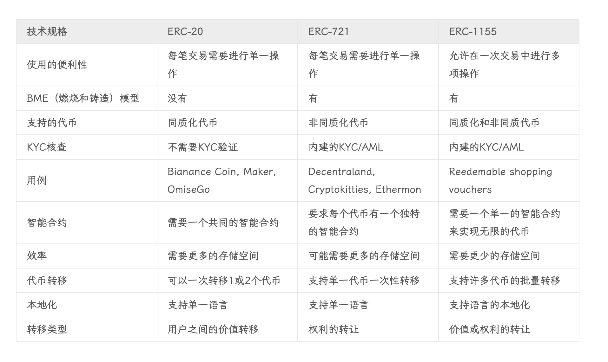
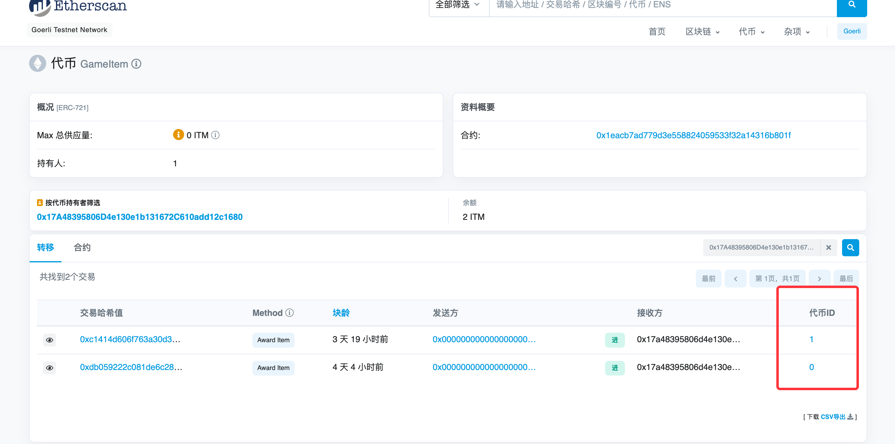

## 结构

```
├── course1 # web3入门
│   ├── README.md
│   ├── call_fun.html
│   ├── contract.js
│   ├── hello-world.sol
│   └── transation.html
├── course2 # truffle入门
│   ├── README.md
│   ├── build
│   │   └── contracts
│   ├── contracts
│   ├── migrations
│   ├── test
│   └── truffle-config.js
├── course3 # dapp开发
│   └── README.md
├── course4 # nft开发
│   └── README.md
├── course5 # defi开发
│   └── README.md

```

## 区块链

```
# matic 作为以太坊二层网络是兼容以太坊的  matic 和 eth 可以是一个地址 通过货币符号判定转入
# 但是像莱特币这种是一种新币 它和以太坊不兼容
eth: https://goerli.etherscan.io
cfx: https://www.confluxscan.io
matic: https://polygonscan.com

# 挖矿
可以是指 A对B的交易、A进行铸造（外部地址向合约地址）这些行为均需要矿工进行确认, 矿工计算满足前n位hash为0,
计算成功后发起广播，这笔手续费会打给矿工
Gas Fee（Tx Fee） = Gas Limit(限制) 和 Gas Price(价格) 相乘得到
Gas Limit由支付者控制  Gas Price
Gas Price燃料价格：动态计算  单位gwei

## gas
在EVM里面，每个运算、操作、存储都需要gas的，比如：
ADD：加法操作 3gas
MUL：乘法操作 5gas
SUB：减法操作 3gas
DIV：除法操作 5gas
JUMP：跳转操作 8gas
MSTORE：内容存储操作 3gas
MLOAD：内容读取操作 3gas
CREATE：创建合约 32000gas (if tx.to == null)
SSTORE：存入存储区 20000gas （从0设为非0值）
SHA3：Keccak256哈希 30gas + 6gas * (size of input in words) + mem_expansion_cost
交易基本费用：21000gas （比如Transfer就要这么多）

# 单位 单位1000
ether ---> finney ---> gwei ---> wei

# 标准文档
https://github.com/ethereum/EIPs/blob/master/EIPS/eip-721.md
https://eips.ethereum.org/EIPS/eip-1155

# 自建区块链 客户端
https://goethereumbook.org/zh/account-balance/

# 学习文档
https://learnblockchain.cn/books/geth/part1/gas.html
```

## 网站

```
币安交易所：https://www.binance.com
ntf交易：https://opensea.io/collection
预言机：https://docs.chain.link/vrf/v2/introduction
合约标准库：https://docs.openzeppelin.com/contracts/4.x/tokens
nftsacn: https://www.nftscan.com/
gas: https://ethgasstation.info/
综合搜索网站：https://blockscan.com/
```

## 标准

```
Ethereum Request for Comments: ERC
https://ethereum.org/zh/developers/docs/standards/tokens/erc-721/
https://hicoldcat.com/posts/blockchain/erc/

ERC-20: 同质化代币 (eg. imtoken)
ERC-721： 非同质化代币（eg. nft）
ERC-1155: ERC-1155可以执行ERC-20和ERC-720的功能，甚至可以同时执行两者,ERC-1155适用于创建NFT、可兑换购物券、ICO等
ERC-4626: 借贷市场、聚合器和本质上计息的代币可以帮助用户通过执行不同的策略来找到他们的加密代币的最佳收益
```



## 测试币

```
# 水龙头
# 以下地址可以领取 goerli 币
https://goerli-faucet.pk910.de/
https://goerlifaucet.com/

# sepolia
https://sepolia-faucet.pk910.de/
```

## 概念

```
# 基础知识（https://help.tokenpocket.pro/cn/the-basics/what-is-the-miner-fee）
链：第二代区块链 以太坊
币：私有链和联盟链可以不发行币，因为服务器都是自己的，无意义，只需具备共识机制即可
代币：同质化代币erc20、非同质化代币erc721
gas: 矿工费 = Gas Limit * Gas Price 网络费，顾名思义就是支付给矿工的手续费，当您在区块链上进行转账时，矿工（或节点）需要把您的转账交易打包并放上区块链，才能使交易完成，在这过程中会消耗区块链的运算资源，因此产生矿工费用。
txn(Transaction Hash): 交易哈希，可以理解为交易编号
区块浏览器：查询区块链上的信息
dex: 去中心化交易所  uniswap 自动做市商
中心化交易所：币安等
合约地址：有代码  内部账户  只有代码没有私钥
账户地址：无代码  外部账户  无代码有私钥
# 如何在不同链部署地址完全相同的合约
https://zhuanlan.zhihu.com/p/455735178
```

[](doc/img.png)

## erc理解

```
1. 外部地址：每个账户拥有的代币，可以在 scan页面看到
2. 合约地址：记录交易记录、交易事件、代币情况
3. 可以看到erc20展示的是数量(发行量固定，不会贬值，要么泡沫要么升值，即同质性)，erc721展示的是代币ID(每个代币的价值都不同，即非同质性)

# 代币
https://goerli.etherscan.io/token/0x326c977e6efc84e512bb9c30f76e30c160ed06fb?a=0x17A48395806D4e130e1b131672C610add12c1680
https://goerli.etherscan.io/token/0x1eacb7ad779d3e558824059533f32a14316b801f?a=0x17A48395806D4e130e1b131672C610add12c1680
# 合约 
https://goerli.etherscan.io/address/0x1eACb7AD779d3e558824059533F32A14316B801F
https://goerli.etherscan.io/address/0x326c977e6efc84e512bb9c30f76e30c160ed06fb  chainlink
# 账户  展示交易记录 下属代币 交易gas 交易tx
https://goerli.etherscan.io/address/0x17a48395806d4e130e1b131672c610add12c1680
```





## 扩展

```
# sui
https://github.com/MystenLabs/sui
https://mirror.xyz/selltome.eth/Ech4eHbxp6B0bClQ4GWiyy2_M8MXtSxFyT-pvDm5rmw

# 公链
每个人都可以参与，是最相对去中心化的产品

# 联盟链
一般是多个企业或者高校组建，采取邀请或者审核准入机制，也是根据投票机制进行裁判，但是受中心化控制，伪去中心化

# 私有链  需要开发区块链浏览器 即  xxxscan.com
企业自建，使用类似的开源 https://github.com/ethereum/go-ethereum，这种区块链由企业自主控制，后期可以快速的接入公链或者联盟链等
```