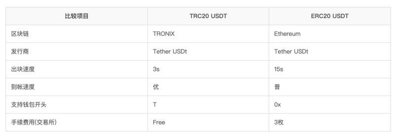
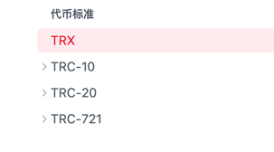

### 概念

```
Tron：就是指的波场区块链（相当于Ethereum就是以太坊）
TRX：它是Tron区块链的原生代币，用于支付gas费用（以太坊原生代币是ETH）
TRC20：是Tron区块链发行的代币协议，USDT在波场区块链发行就是USDT-TRC20代币（以太坊的代币协议是ERC20）
```

### 原生代币

```
TRX:
```

### 发行代币

```
TRX是Tron的区块链代币
# 仿以太坊的产品（https://www.wwsww.cn/jishu/7814.html）
TRC-20: 交易不需要手续费

```




### 交易网站

```
https://www.sunswap.com/?lang=zh-CN#/home
```

### 开发文档

```
https://cn.developers.tron.network/docs/trc20-protocol-interface
```