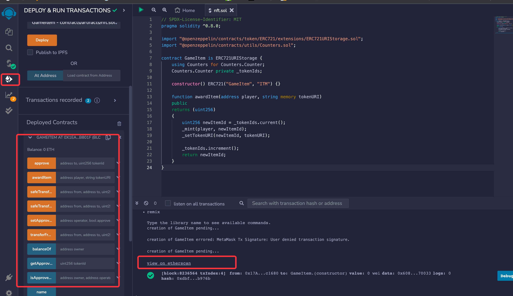
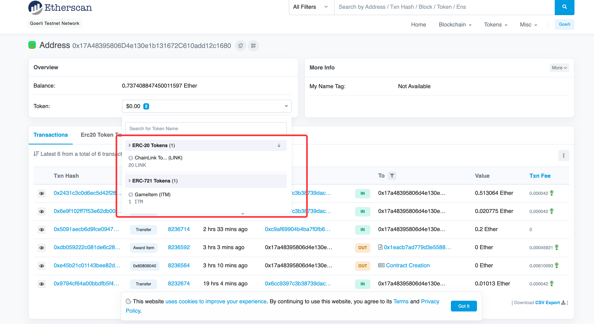

## NFT 开发

### 概念

```
# 入门视频
https://www.bilibili.com/video/BV1VZ4y1v7im/?spm_id_from=333.788&vd_source=44c52730b7b5612e95a86d9473811e95

# 遵循 ERC721标准
metadata: 铸造商品的元数据 类似spu和sku
ContractURI：nft集合连接  类似 店铺连接
collection：集合  https://opensea.io/collection/a-llamily-christmas
tokenID: 一个计数器 可以理解为spu_id(递增) Counters.Counter private _tokenIds
TokenURI: spu api 链接

# 流程
使用metamask登录后，钱包地址以 中心化存储进行保存  进行nft交易
在这两个情况的前提下，才会触发opensea调用对应的公链进行 nft的铸造  （mint 创建一个新的从0地址转移到购买者或者操作者）
当您将项目转移到另一个账户时 当有人向您购买项目时 
opensea铸造免费  出售的时候需要进行签名   nft在二级市场流通 每次都会产生交易费 可以在此赚钱
点击铸造，player 和 tokenuri 传入 ，opensea会收到事件  进行erc721的读取

# opensea支持的代币
https://support.opensea.io/hc/zh-tw/articles/4404027708051-%E5%93%AA%E4%BA%9B%E5%8D%80%E5%A1%8A%E9%8F%88%E8%88%87-OpenSea-%E7%9B%B8%E5%AE%B9-
```

### 开发

```
# 使用uniapp开发 nft

# 接入 opensea
https://opensea.io/

# 使用
hardhat 进行开发
```

### 理解

```
# nft 的元数据可以在 ipfs上面存储  也可以在中央服务器来存储
安装规定实现规定的方法  opensea 便会进行元数据的调用 并在网页进行展示

# metadata 规范
https://docs.opensea.io/docs/metadata-standards

# 元数据
一组json数据

# ERC721
只需要实现了 ERC721 标准便可以进行上传铸造

# 合约地址

```

### 可升级合约

```
# 由于区块链代码一经部署不可修改，那么我没应该如何升级自己的代码呢？
https://hicoldcat.com/posts/blockchain/what-are-upgradable-smart-contracts-full-guide/
https://learnblockchain.cn/article/5167
```

### web3.js调用

```
# 调用 合约地址可以获取到对应的信息  移动端如何进行交互（opensea）

```

### 测试网络

```
https://testnets.opensea.io/account?tab=collected
# 使用测试网络完成nft的铸造  合约的部署需要花费gas
https://testnets.opensea.io/account

# 测试用json 
https://github.com/kasoqian/HassanNFT-metadata/
https://raw.githubusercontent.com/kasoqian/HassanNFT-metadata/main/metadata/json/1.json

# 以太坊测试账户
https://goerli.etherscan.io/address/0x17A48395806D4e130e1b131672C610add12c1680

# 点击部署后会生成测试网络的以太坊状态  部署生成
https://goerli.etherscan.io/tx/0xe45b21c01143bee82d33a649cdedafde9a276c886dd759748aaedf615a46863b

# 铸造生成
https://goerli.etherscan.io/tx/0xdb059222c081de6c282950742d53445108a0663083e41b7baa0b62b73fd166cc

# opensea生成
https://testnets.opensea.io/assets/goerli/0x1eacb7ad779d3e558824059533f32a14316b801f/0

https://goerli.etherscan.io/address/0x1eacb7ad779d3e558824059533f32a14316b801f
代币合约地址：0x1eACb7AD779d3e558824059533F32A14316B801F

# 方法作用
awardItem: 铸造nft

```




```solidity
contract MyCollectible is ERC721 {
    function contractURI() public view returns (string memory) {
        return "https: //metadata-url.com/my-metadata";
    }
}
```

### nft 合集信息 (https://docs.opensea.io/docs/contract-level-metadata)

- fee_recipient: 接收地址
- 即ContractURI

```json
{
  "name": "OpenSea Creatures",
  "description": "OpenSea Creatures are adorable aquatic beings primarily for demonstrating what can be done using the OpenSea platform. Adopt one today to try out all the OpenSea buying, selling, and bidding feature set.",
  "image": "external-link-url/image.png",
  "external_link": "external-link-url",
  "seller_fee_basis_points": 100,
  "fee_recipient": "0xA97F337c39cccE66adfeCB2BF99C1DdC54C2D721"
}
```

### nft 商品属性

- 即TokenURI

```json
{
  "name": "Hassan #1",
  "description": "Hassan Calloway is heir to Calloway Arms, one of the world's leading mil-tech suppliers. Ingenious and determined, Hassan has been searching for his missing father, and for SHRAP, since Earthfall.",
  "image": "https://raw.githubusercontent.com/kasoqian/HassanNFT/main/metadata/images/4.png",
  "attributes": [
    {
      "trait_type": "health",
      "value": "9"
    },
    {
      "trait_type": "power",
      "value": "68"
    },
    {
      "trait_type": "magic",
      "value": "16"
    },
    {
      "trait_type": "exp",
      "value": "93"
    },
    {
      "trait_type": "lv",
      "value": "R"
    }
  ]
}
```

### 接口

- https://zhuanlan.zhihu.com/p/412101517

```solidity
interface ERC721 /* is ERC165 */ {

    // 转帐
    event Transfer(address indexed _from, address indexed _to, uint256 indexed _tokenId);

    event Approval(address indexed _owner, address indexed _approved, uint256 indexed _tokenId);

    event ApprovalForAll(address indexed _owner, address indexed _operator, bool _approved);

    // 获取一个地址下有多少个nft
    function balanceOf(address _owner) external view returns (uint256);

    // 根据token返回拥有者的账户地址
    function ownerOf(uint256 _tokenId) external view returns (address);

    // nft转帐  向0地址转移会报错  二级市场
    function safeTransferFrom(address _from, address _to, uint256 _tokenId, bytes data) external payable;

    // nft转帐  向0地址转移会报错  二级市场
    function safeTransferFrom(address _from, address _to, uint256 _tokenId) external payable;

    // 可以向0地址转帐  但0地址是黑洞  一旦转入无法取回
    function transferFrom(address _from, address _to, uint256 _tokenId) external payable;

    // 以下为账户代管理
    function approve(address _approved, uint256 _tokenId) external payable;

    function setApprovalForAll(address _operator, bool _approved) external;

    function getApproved(uint256 _tokenId) external view returns (address);

    function isApprovedForAll(address _owner, address _operator) external view returns (bool);
}

interface ERC165 {
    function supportsInterface(bytes4 interfaceID) external view returns (bool);
}

interface ERC721TokenReceiver {

    function onERC721Received(address _operator, address _from, uint256 _tokenId, bytes _data) external returns (bytes4);
}

// opensea 类似网站调用该接口展示信息
interface ERC721Metadata /* is ERC721 */ {

    function name() external view returns (string _name);

    function symbol() external view returns (string _symbol);

    function tokenURI(uint256 _tokenId) external view returns (string);
}

// 发行信息
interface ERC721Enumerable /* is ERC721 */ {

    function totalSupply() external view returns (uint256);

    function tokenByIndex(uint256 _index) external view returns (uint256);

    function tokenOfOwnerByIndex(address _owner, uint256 _index) external view returns (uint256);
}


```

### nft 术语

```
https://school.gugu.fund/blog/crypto/2700710363

GM/GN：GM 為 Good Morning 的縮寫，GN 為 Good Night 的縮寫，因此每天時間一到，大家在 NFT 社群中都會以此作為打招呼。

FOMO：FOMO 是 The Fear of Missing Out 的縮寫，代表「害怕錯過」的意思，有些人深怕自己錯過下一波市場的大行情，因而盲目買進某個 NFT 項目，這樣的人也被稱做 FOMOer。

Mint：在 NFT 的交易市場中常常看到「Mint」這個單字​，到底是什麼意思呢？Mint 中文為「鑄造」的意思，意即創作者第一次在區塊鏈上「鑄造」出一個 NFT，而在許多 NFT 項目的官網上，首次發行時都是用 Mint 按鍵來進行交易，代表在買方申購的當下，才會將 NFT 鑄造產出。

Burn：NFT 既然可以 Mint「鑄造」，當然也可以 Burn「銷毀」。在區塊鏈上若想要刪除 NFT ，只能透過銷毀的功能，最後只會留下鑄造和燒毀日期，有時會為了減少數量以提升稀有度而進行銷毀。

1：1 Art：「1：1」並非指尺寸上定義，而是指每件藝術品都是獨一無二的，而 PFP(Profile Picture)及 Generative Art 類型的 NFT 就是使用此種智能合約。 

Floor Price：Floor Price（地板價），指的是某一系列 NFT 在交易市場中的「最低入手價格」，所以 Floor Price 越高，代表整個系列的價格越高！也有些人會大量買入仍處於地板價的 NFT，期待未來有爆漲的機會。 

Rug Pull：若直譯翻為「拉地毯」的意思，在 NFT 世界中，代表開始販售 NFT 之後捲款潛逃的詐騙行為，就像是商販直接「捲舖蓋跑路」一般。

Discord(DC社群)：Discord是一種社群軟體！許多NFT同好會在上面創立聊天室，在上面可以輕鬆獲取跟NFT有關的所有資訊，例如行情、最新系列、新手入門問答等等，也是 NFT 玩家們很重要的社交場所。 

DAO：Decentralized Autonomous Organization 的縮寫，中文為去中心化自治組織。如果你所參加的項目屬於 Head DAO ，買下 NFT 後，你和其他 NFT 持有者都擁有投票權，可以參與項目接下來的決策， 如今有越來越多 NFT 項目開始建立組織框架，來吸引更多支持者加入。

PFP（大頭貼）：PFP 是 profile picture 的縮寫，許多名人會用 NFT 圖像來當自己社群媒體的大頭貼，像是最有名的猴子頭像等等，而 NFT 圈流行所說的 PFP，其實就是「大頭貼」。 

Gas fee：通常在 NFT 交易市場中，Gas Fee 會出現在鑄造作品的過程中需要支付的手續費，也會在交易買賣時出現，而 Gas Fee 的費用都是依照當時的匯率浮動。

Gas War：許多熱門的 NFT 項目一推出，常會發生礦工費大戰。你必須付出比別人更高的 Gas Fee，才能成功讓交易通過，這就是所謂的「Gas War」。

Whitelist（白名單）：在一個 NFT 新項目發行之前，通常官方會採取白名單機制，完成指定任務就有機會加入白名單，加入後就可以獲取搶先鑄造或收藏 NFT 的資格，因此就不需要參與到上面所說的 Gas War ，基本上只要 Mint 就一定 Mint 的到，因為那等於是官方保留給你的。

Airdrop（空投）：有些 NFT 為了行銷目的或是獎勵用戶，會使用空投的方式將免費 NFT 丟進用戶的錢包地址中，這就是我們常聽到的「Airdrop」。

Roadmap：「路線圖」的意思，可以讓用戶知道該 NFT 的未來發展與走向，也能透過 Roadmap 來確認項目是否可行，像是代幣的白皮書。
```

## 问题

```
注意 codeup 私有源和 阿里云公开yum源
//查看源
npm config get registry
//更换源
npm config set registry https://registry.npmjs.org
//淘宝源
npm config set registry https://registry.npm.taobao.org

```

### hardhat

```
npm install --save-dev hardhat

```

# Sample Hardhat Project

This project demonstrates a basic Hardhat use case. It comes with a sample contract, a test for that contract, and a
script that deploys that contract.

Try running some of the following tasks:

```
npx hardhat help
# 单元测试
npx hardhat test
REPORT_GAS=true npx hardhat test
# 启动测试节点 http://127.0.0.1:8545/
npx hardhat node
# 部署合约  在自带的evm虚拟机内部测试署
npx hardhat run scripts/deploy.ts
# 编译合约  会生成 cache和artifacts 两个文件
npx hardhat compile
# 部署到测试网络
npx hardhat run scripts/deploy.ts --network test
npx hardhat verify --list-networks
```

## 运行文档

```
# 区块链博客
https://mirror.xyz/0x888888902106DA57dFC0E44712eD899f394c07F5/VIZpWwvh-Xes3qp-emglq0HAbH6DQEsRvogq3iO-pSs

# etherscan 需要申请key
cnpm install --save-dev @nomiclabs/hardhat-etherscan
https://hardhat.org/hardhat-runner/plugins/nomiclabs-hardhat-etherscan#adding-support-for-other-networks

```
